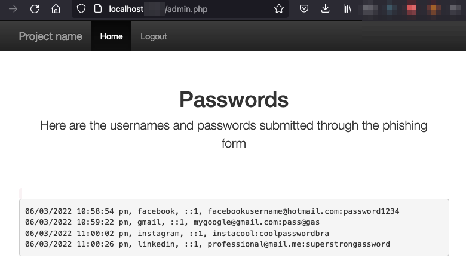

# Joker Phish

Clown = Joker, Fish = Phish...Get it? Whatever.

**A phishing website to collect credentials.**


The index page prompts the user to use one of the following FAKE sign-in pages:

1. Facebook
2. Google
3. Instagram
4. LinkedIn
5. Twitter
6. Snapchat
7. Outlook


## Download

`git clone https://github.com/offport/JokerPhish.git`

## Requirements

PHP

`sudo apt-get install php`

Yes! Just PHP! 

## Run server

```
cd JokerPhish

php -S localhost:80
```

Browse to http://localhost and check the site.

## The stored credentials

Go to http://localhost/admin.php and login with `admin:changeme`

 

You can change the credentials in the `auth.php` file.

